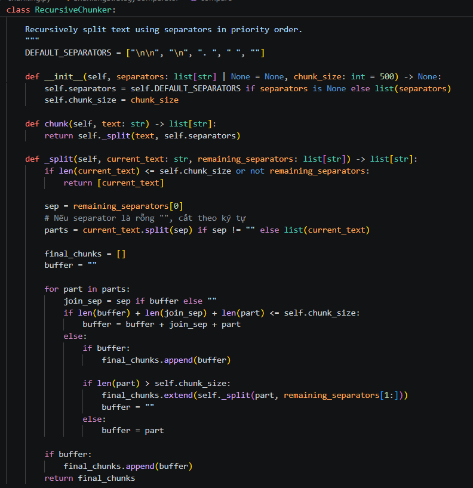

# Báo Cáo Lab 7: Embedding & Vector Store

**Họ tên:** Lê Nguyễn Thanh Bình 
**Nhóm:** Nhóm 03
**Ngày:** 10/04/2026

---

## 1. Warm-up (5 điểm)

### Cosine Similarity (Ex 1.1)

**High cosine similarity nghĩa là gì?**
> Chỉ số này đo lường góc giữa hai vector trong không gian đa chiều. High cosine similarity (gần bằng 1) có nghĩa là hai đoạn văn bản có sự tương đồng rất lớn về mặt ngữ nghĩa và nội dung, dù cách sử dụng từ ngữ có thể khác nhau.

**Ví dụ HIGH similarity:**
- Sentence A:"Người em chia cho chim thần túi ba gang để đựng vàng."
- Sentence B:"Chim thần bảo người em may túi ba gang mang đi lấy vàng trả ơn."
- Tại sao tương đồng: Cả hai đều xoay quanh tình tiết cốt lõi là chiếc túi ba gang và việc trả ơn bằng vàng trong truyện Cây Khế.

**Ví dụ LOW similarity:**
- Sentence A:"Thạch Sanh sống lủi thủi dưới gốc đa."
- Sentence B:"Sự tích Hồ Gươm gắn liền với lịch sử chống giặc Minh."
- Tại sao khác: Hai câu này thuộc hai bối cảnh truyện khác nhau hoàn toàn, không có điểm chung về nhân vật hay sự kiện.

**Tại sao cosine similarity được ưu tiên hơn Euclidean distance cho text embeddings?**
> Euclidean distance bị ảnh hưởng bởi độ dài của văn bản (magnitude). Trong khi đó, Cosine Similarity chỉ quan tâm đến hướng (direction) của vector. Điều này cực kỳ quan trọng trong NLP vì một đoạn văn ngắn và một đoạn văn dài có cùng chủ đề vẫn sẽ có hướng vector giống nhau, giúp việc tìm kiếm chính xác hơn.

### Chunking Math (Ex 1.2)

**Document 10,000 ký tự, chunk_size=500, overlap=50. Bao nhiêu chunks?**
> *Trình bày phép tính:* Áp dụng công thức: $num\_chunks = ceil((10000 - 50) / (500 - 50)) = ceil(9950 / 450) = 22.11$

> *Đáp án:* 23 chunks.

**Nếu overlap tăng lên 100, chunk count thay đổi thế nào? Tại sao muốn overlap nhiều hơn?**
> Số lượng chunk sẽ tăng lên (khoảng 25 chunk). Chúng ta muốn overlap nhiều hơn để đảm bảo rằng các thông tin quan trọng nằm ở ranh giới giữa hai chunk không bị cắt đứt, giúp AI duy trì được tính liên tục của ngữ cảnh (contextual flow).

---

## 2. Document Selection — Nhóm (10 điểm)

### Domain & Lý Do Chọn

**Domain:** Vietnamese Fairy Tales - Truyện cổ tích Việt Nam

**Tại sao nhóm chọn domain này?**
> Truyện cổ tích có context dài, nội dung phong phú và cấu trúc rõ ràng — phù hợp để kiểm tra khả năng retrieve chính xác của RAG

### Data Inventory

| # | Tên tài liệu | Nguồn lẫy | Số ký tự | Metadata đã gán |
|---|--------------|-----------|----------|-----------------|
| 1 | Sọ Dừa | `loigiaihay.com` | 5634 | `{"category": "truyện", "theme": "bài học rút ra"}` |
| 2 | Thạch Sanh | `loigiaihay.com` | 9207 | `{"category": "truyện", "theme": "bài học rút ra"}` |
| 3 | Sự Tích Hồ Gươm| `loigiaihay.com` | 7017 | `{"category": "sự tích", "theme": "lịch sử dân tộc"}` |
| 4 | Ngưu Lang Chúc Nữ | `loigiaihay.com` | 6850 | `{"category": "truyện", "theme": "tình yêu - bài học"}` |
| 5 | Cây Khế | `loigiaihay.com` | 5240 | `{"category": "truyện", "theme": "bài học rút ra"}` |

### Metadata Schema

| Trường metadata | Kiểu | Ví dụ giá trị | Tại sao hữu ích cho retrieval? |
|----------------|------|---------------|-------------------------------|
| story_title | list | ["Sọ Dừa"] | Lọc đúng tài liệu khi user hỏi theo tên truyện |
| story_type | string | "cổ tích" / "truyền thuyết" | Phân loại thể loại, filter theo nhóm |
| origin | string | "Việt Nam" / "Trung Quốc" | Phân biệt nguồn gốc truyện |
| main_characters | list | ["Sọ Dừa", "Phú Ông"] | Retrieve tài liệu khi user hỏi về nhân vật cụ thể |
| themes | list | ["phép thuật", "tình yêu"] | Gợi ý truyện cùng chủ đề |

---

## 3. Chunking Strategy — Cá nhân chọn, nhóm so sánh (15 điểm)

### Baseline Analysis

Chạy `ChunkingStrategyComparator().compare()` trên 2 tài liệu "Thạch Sanh" và "Sọ Dừa":

| Tài liệu           | Strategy                         | Chunk Count | Avg Length | Preserves Context?                                                                                                                           |
| ------------------ | -------------------------------- | ----------- | ---------- | -------------------------------------------------------------------------------------------------------------------------------------------- |
| cayke.txt          | FixedSizeChunker (`fixed_size`)  | 47          | 198.2      | Cắt theo số ký tự cứng nhắc. Rất dễ cắt đôi từ hoặc cắt giữa câu, làm mất ý nghĩa.                                                           |
|                    | SentenceChunker (`by_sentences`) | 23          | 303.0      | Giữ được trọn vẹn ý nghĩa của từng câu. Tuy nhiên, mối liên hệ giữa các câu trong cùng một đoạn có thể bị mất.                               |
|                    | RecursiveChunker (`recursive`)   | 54          | 128.0      | Ưu tiên cắt theo đoạn văn (\n\n), sau đó mới đến dòng (\n) và câu. Nó giữ các thông tin có liên quan về mặt cấu trúc ở gần nhau nhất có thể. |
| nguulangchucnu.txt | FixedSizeChunker (`fixed_size`)  | 35          | 199.5      | Xuyên tạc ý nghĩa do cắt vụn giữa các đoạn hội thoại hoặc diễn biến tình cảm quan trọng của Ngưu Lang và Chúc Nữ. |
|                    | SentenceChunker (`by_sentences`) | 13          | 404.4      | Khá tốt, bảo toàn được nội dung trọn vẹn của câu nói mong nhớ, nhưng làm đứt gãy luồng cảm xúc liền mạch giữa 2 câu. |
|                    | RecursiveChunker (`recursive`)   | 41          | 127.0      | Giữ được toàn bộ diễn biến của từng phân cảnh (như cảnh chia ly ở sông Ngân) trong một khối duy nhất. |
| sodua.txt          | FixedSizeChunker (`fixed_size`)  | 38          | 196.9      | Mất ngữ cảnh về sự biến hóa về diện mạo và hành động của Sọ Dừa do chunk bị cắt cụt ở giữa dòng miêu tả. |
|                    | SentenceChunker (`by_sentences`) | 24          | 232.8      | Ổn định, nhưng làm đứt liên kết nguyên nhân - kết quả của câu chuyện. |
|                    | RecursiveChunker (`recursive`)   | 39          | 142.5      | Bao bọc toàn bộ các tình huống phép thuật kì ảo của Sọ Dừa nguyên vẹn trong một chunk. |

### Strategy Của Tôi

**Loại:** RecursiveChunker
**Mô tả cách hoạt động:**
> Chiến lược này thực hiện chia nhỏ văn bản một cách đệ quy dựa trên một danh sách các dấu phân cách có thứ tự ưu tiên giảm dần, bao gồm: đoạn văn (\n\n), dòng (\n), câu (. ), và khoảng trắng ( ). Hệ thống sẽ cố gắng giữ các khối văn bản lớn nhất có thể; nếu một khối vượt quá chunk_size, nó sẽ tìm dấu phân cách tiếp theo trong danh sách để tiếp tục chia nhỏ cho đến khi đạt kích thước mục tiêu. Điều này giúp đảm bảo các đoạn văn có ý nghĩa liên quan không bị ngắt quãng một cách tùy tiện.

**Tại sao tôi chọn strategy này cho domain nhóm?**
> Domain truyện cổ tích có cấu trúc cốt truyện rất chặt chẽ, trong đó mỗi đoạn văn (\n\n) thường chứa đựng một tình tiết hoặc một biến cố hoàn chỉnh của nhân vật. Việc sử dụng RecursiveChunker cho phép hệ thống ưu tiên giữ nguyên các đoạn văn hoặc các câu đối thoại quan trọng, giúp Agent có đủ ngữ cảnh (context) để trả lời chính xác các câu hỏi về nguyên nhân - kết quả mà không bị mất mát thông tin giữa chừng.
**Code snippet (nếu custom):**

```python
# Paste implementation here
```

### So Sánh: Strategy của tôi vs Baseline

| Tài liệu | Strategy | Chunk Count | Avg Length | Retrieval Quality? |
|-----------|----------|-------------|------------|--------------------|
| | best baseline | | | |
| | **của tôi** | | | |

### So Sánh Với Thành Viên Khác

| Thành viên | Strategy | Retrieval Score (/10) | Điểm mạnh | Điểm yếu |
|-----------|----------|----------------------|-----------|----------|
| Tôi | | | | |
| [Tên] | | | | |
| [Tên] | | | | |

**Strategy nào tốt nhất cho domain này? Tại sao?**
> *Viết 2-3 câu:*

---

## 4. My Approach — Cá nhân (10 điểm)

Giải thích cách tiếp cận của bạn khi implement các phần chính trong package `src`.

### Chunking Functions

**`SentenceChunker.chunk`** — approach:
> *Viết 2-3 câu: dùng regex gì để detect sentence? Xử lý edge case nào?*

**`RecursiveChunker.chunk` / `_split`** — approach:
> *Viết 2-3 câu: algorithm hoạt động thế nào? Base case là gì?*

### EmbeddingStore

**`add_documents` + `search`** — approach:
> *Viết 2-3 câu: lưu trữ thế nào? Tính similarity ra sao?*

**`search_with_filter` + `delete_document`** — approach:
> *Viết 2-3 câu: filter trước hay sau? Delete bằng cách nào?*

### KnowledgeBaseAgent

**`answer`** — approach:
> *Viết 2-3 câu: prompt structure? Cách inject context?*

### Test Results

```
# Paste output of: pytest tests/ -v
```

**Số tests pass:** __ / __

---

## 5. Similarity Predictions — Cá nhân (5 điểm)

| Pair | Sentence A | Sentence B | Dự đoán | Actual Score | Đúng? |
|------|-----------|-----------|---------|--------------|-------|
| 1 | | | high / low | | |
| 2 | | | high / low | | |
| 3 | | | high / low | | |
| 4 | | | high / low | | |
| 5 | | | high / low | | |

**Kết quả nào bất ngờ nhất? Điều này nói gì về cách embeddings biểu diễn nghĩa?**
> *Viết 2-3 câu:*

---

## 6. Results — Cá nhân (10 điểm)

Chạy 5 benchmark queries của nhóm trên implementation cá nhân của bạn trong package `src`. **5 queries phải trùng với các thành viên cùng nhóm.**

### Benchmark Queries & Gold Answers (nhóm thống nhất)

| # | Query | Gold Answer |
|---|-------|-------------|
| 1 | | |
| 2 | | |
| 3 | | |
| 4 | | |
| 5 | | |

### Kết Quả Của Tôi

| # | Query | Top-1 Retrieved Chunk (tóm tắt) | Score | Relevant? | Agent Answer (tóm tắt) |
|---|-------|--------------------------------|-------|-----------|------------------------|
| 1 | | | | | |
| 2 | | | | | |
| 3 | | | | | |
| 4 | | | | | |
| 5 | | | | | |

**Bao nhiêu queries trả về chunk relevant trong top-3?** __ / 5

---

## 7. What I Learned (5 điểm — Demo)

**Điều hay nhất tôi học được từ thành viên khác trong nhóm:**
> *Viết 2-3 câu:*

**Điều hay nhất tôi học được từ nhóm khác (qua demo):**
> *Viết 2-3 câu:*

**Nếu làm lại, tôi sẽ thay đổi gì trong data strategy?**
> *Viết 2-3 câu:*

---

## Tự Đánh Giá

| Tiêu chí | Loại | Điểm tự đánh giá |
|----------|------|-------------------|
| Warm-up | Cá nhân | / 5 |
| Document selection | Nhóm | / 10 |
| Chunking strategy | Nhóm | / 15 |
| My approach | Cá nhân | / 10 |
| Similarity predictions | Cá nhân | / 5 |
| Results | Cá nhân | / 10 |
| Core implementation (tests) | Cá nhân | / 30 |
| Demo | Nhóm | / 5 |
| **Tổng** | | **/ 100** |
